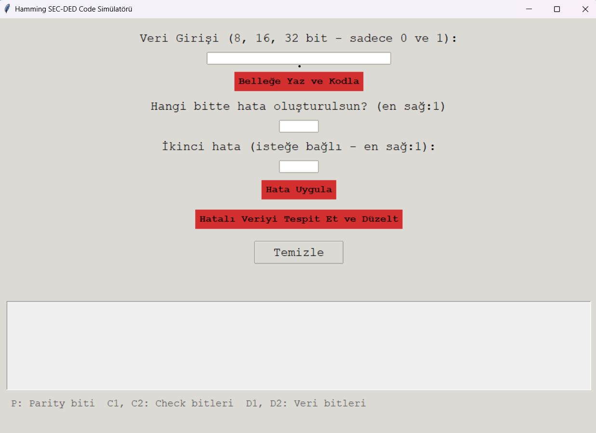
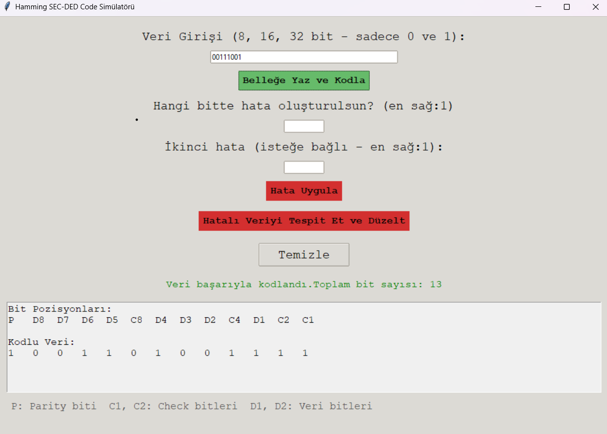
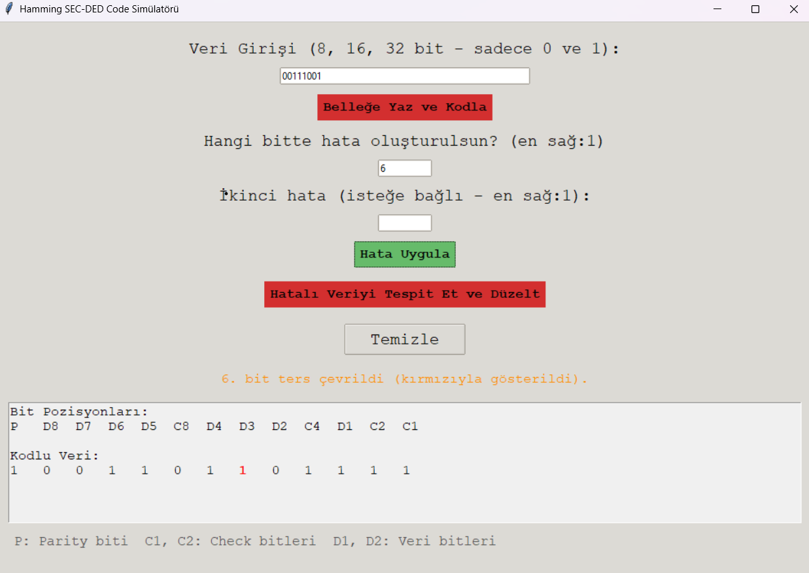
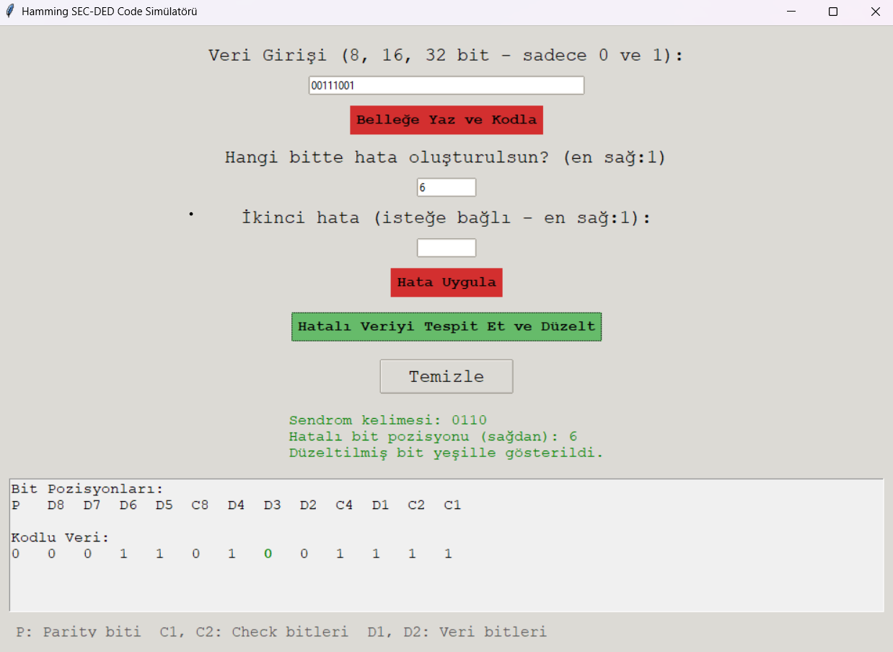
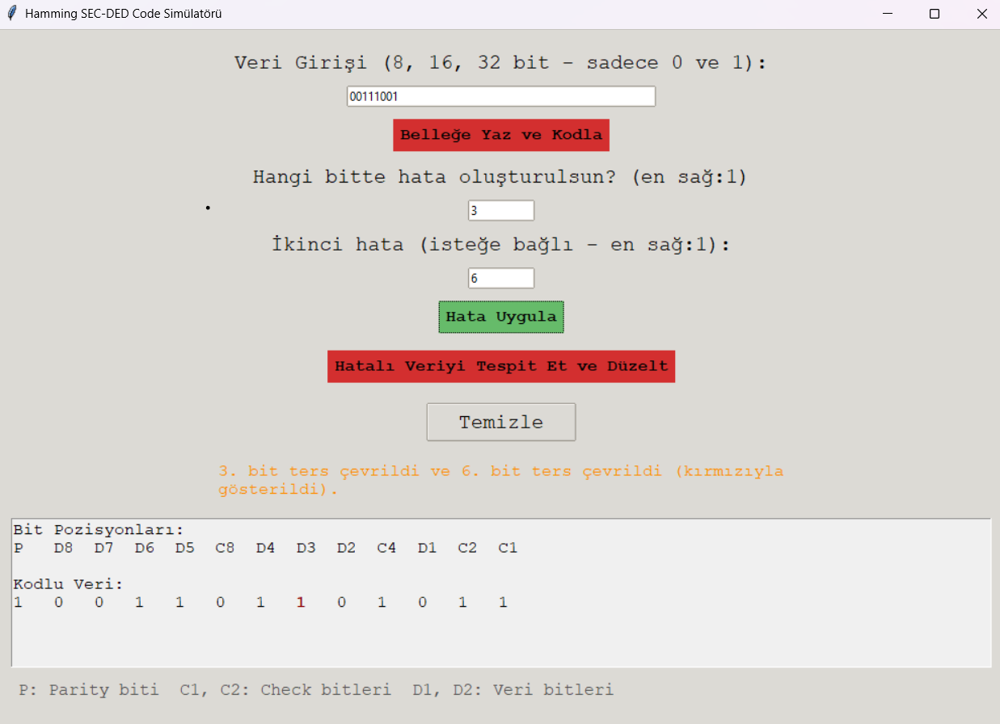
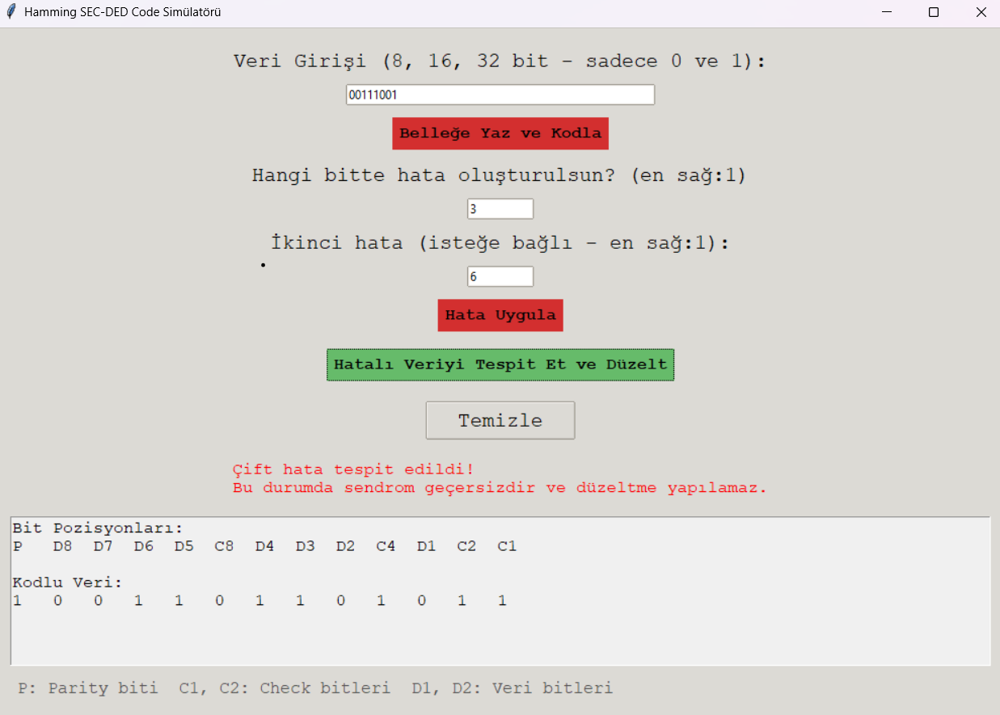

# 🧠 Hamming SEC-DED Simülatörü

Bu proje, Hamming kodlaması kullanarak tek-bit hata düzeltme (SEC) ve çift-bit hata tespiti (DED) yapabilen bir Python ile yazılmış bir uygulamadır. Kullanıcı dostu bir grafik arayüz (GUI) ile veri girişi, hata ekleme, sendrom hesaplama ve hata düzeltme işlemleri yapılabilir.

## 🚀 Özellikler

- Kullanıcıdan veri girişi alır.(8-16-32 bitlik veriler için uygundur.)
- Gerekli kontrol bitlerini otomatik hesaplar.
- Kodlanmış veriyi gösterir.
- Tek veya çift bitlik hata simülasyonu yapar.
- Tek bitlik hataları tespit eder ve düzeltir.  
- Çift bitlik hataları tespit eder.  
- Hatalı bitleri kırmızı renkle gösterir.  
- Temizle butonuyla arayüzü sıfırlar.

## Kullanım

1. Veri giriş kutusuna 8,16 veya 32 bitlik veriyi girin.  
2. Belleğe yaz ve kodla butonuna tıklayarak hamming kodlu veriyi ve bit numaralarını görebilirsiniz.  
3. Tek bitlik hata simülasyonu yapmak için hata olacak bit numarasını(sağdan ve 1 den saymaya başlayarak) girin ve hata uygula butonuna basın.  
- Böylelikle aşağıda hata bitinin ters çevrilmiş halini görebilirsiniz(ilgili bit kırmızıyla işaretlenecektir.)  
- Hatalı veriyi tespit et ve düzelt butonuna bastığınızda ise ekranda sendrom kelimesini ve hata bitinin numarasını görürsünüz ve aşağıdaki veri bitinde hata bitinin düzeltilmiş halini görürsünüz(ilgili bit yeşille işaretlenecektir.)  
4. Çift bitlik hata simülasyonu yapmak içinse hata olacak bit numaralarını girin(bunun için iki text kutusu bulunuyor.)  
- Hatayı uygula dediginizde ilgili bitlerin tersine çevrildiğini görürsünüz.  
- Hatalı veriyi tespit et ve düzelt butonuna bastığınızda ise çift hata tespiti olduğuna dair mesaj alırsınız.  

## Yukarıdaki adımların görselli anlatımı
- Başlangıç ekranı  

- Veri girişi ve hamming kodu oluşturma  

  

- Tek bitte hata oluşturma  

  

- Hatalı veriyi tespit edip düzeltme  

  

- Çift bitte hata oluşturma  

  

- Çift bit hatasını tespit etme  

  

## 🛠️ Kullanılan Teknolojiler

- Python 3
- Tkinter (GUI için)

## 🔧 Kurulum ve Çalıştırma

1. Python 3 yüklü olduğundan emin olun.
2. Projeyi indirin veya klonlayın.
3. Masaüstünüzde proje dosyasını açıp main.py dosyasını çalıştırın.

